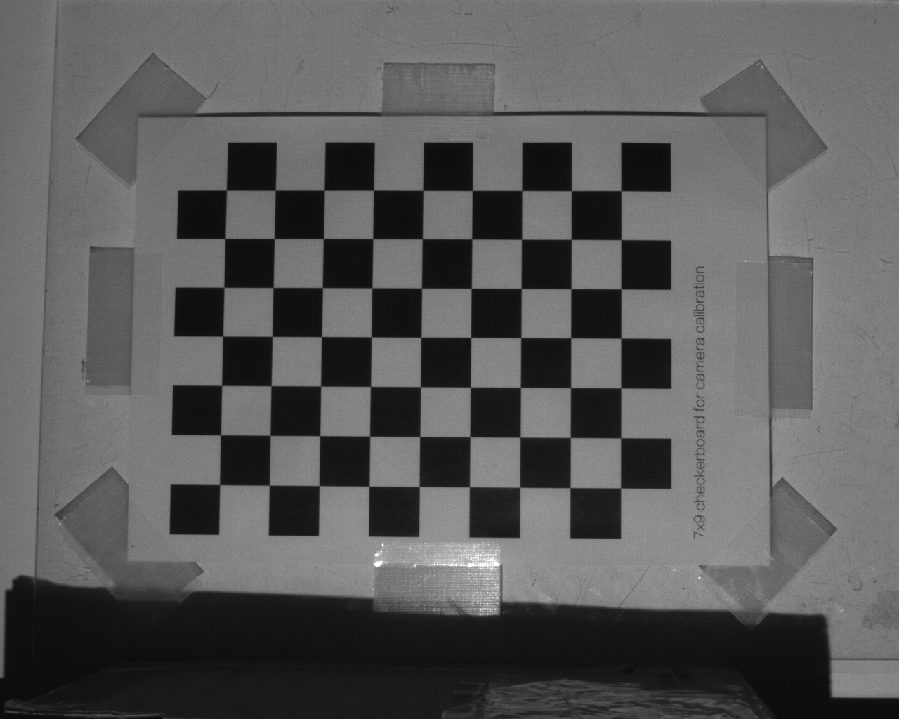
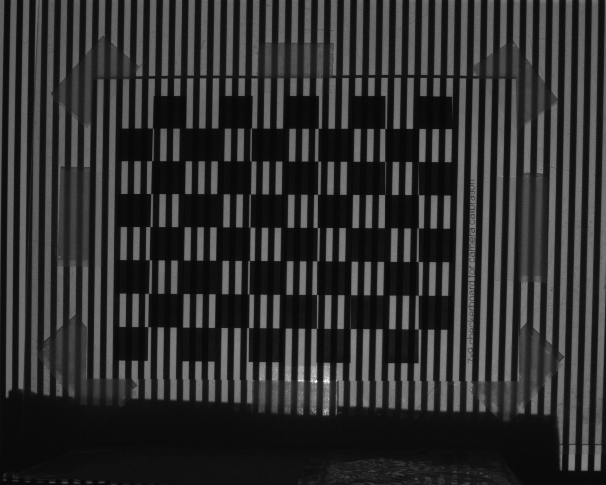

# procam-calibration

This repository provides python scripts to calibrate projector-camera system using a chessboard and structured light (the gray codes).

## Requirement

* Python
    * Python 3 is recommended
* OpenCV
    * `python -m pip install opencv-python opencv-contrib-python`
* Printed chessboard
    * You can find PDF [here](http://opencv.jp/sample/pics/chesspattern_7x10.pdf)

## How to use
### Step 1 : Generate gray code patterns

Open your terminal and type the following command.

```sh
python gen_graycode_imgs.py <projector_pixel_height> <projector_pixel_width> [-graycode_step <graycode_step(default=1)>]

# example
python gen_graycode_imgs.py 768 1024 -graycode_step 1
```

Generated images will be stored in `./graycode_pattern/`.

`graycode_step` is an option to specify the pixel size of bits in the gray code images.
If you get moire pattern in the captured images in the next step, increase this variable.

### Step 2 : Project and capture the gray code patterns

Set up your system and place a chessboard in front of the projector and camera.
Then, project the gray code patterns generated in the previous step from the projector to it and capture it from the camera.

Although minimum required shot is one, it is recommended to capture more than 5 times with different attitudes of the chessboard to improve the calibration accuracy.

Captured images must be saved as `./capture_*/graycode_*.(png/jpg)`.

<table>
   <tr>
      <td></td>
      <td></td>
   </tr>
</table>

### Step 3 : Calibrate projector & camera parameters

After saving the captured images, run the following command.

```sh
python calibrate.py <projector_pixel_height> <projector_pixel_width> <num_chess_corners_vert> <num_chess_corners_hori> <chess_block_size> <graycode_step> [-black_thr <black_thr(default=40)>] [-white_thr <white_thr(default=5)>][-camera <camera_parameter_json>]

# example (you can test this command in the sample_data directory)
python ../calibrate.py 768 1024 9 7 75 1 -black_thr 40 -white_thr 5
```

`chess_block_size` means the length (mm cm m) of a block on the chessboard.
The translation vectors will be calculated with the units of length used here.

`black_threashold` is a threashold to determine whether a camera pixel captures projected area or not.
`white_threashold` is a threashold to specify the robustness of gray code decoding.
To avoid decoding errors, increase these variables.

`camera_paramter_json` is a json file, in which internal camera paramters (projection matrix P, camera distortion, and image size) are written.
By indicating this option, the intrinsic camera parameters will be fixed when compute the initial solution of the camera attitudes.
See "camera_config.json" as an example.

Calibration result will be displayed on your terminal and saved in `./calibration_result.xml` (with cv::FileStorage format).

## Additional Resource

This repository utilize the stereo calibration method in OpenCV. See the OpenCV documentation for details on coordinate systems, calibration method and output parameters.

This software calculates local homographies at around chessboard corners to estimate corresponding projector pixels with subpixel accuracy.
This algorithm is based on the following paper.

```
MORENO, Daniel; TAUBIN, Gabriel. Simple, accurate, and robust projector-camera calibration. In: 3D Imaging, Modeling, Processing, Visualization and Transmission (3DIMPVT), 2012 Second International Conference on. IEEE, 2012. p. 464-471.
```
